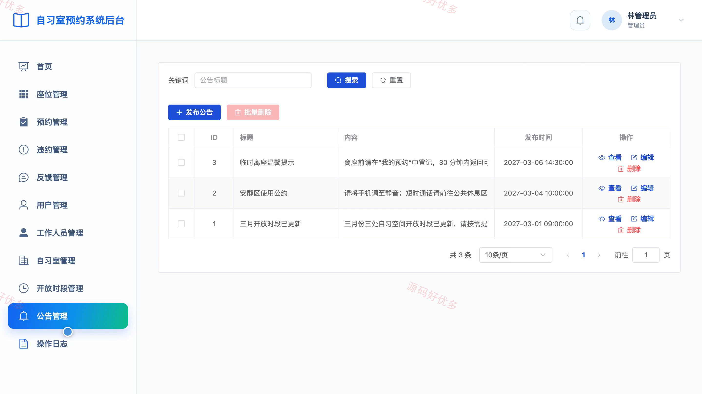

## 源码问题查看主页咨询

### 一、关键词
自习室预约、座位预约、共享自习空间、学习空间预订、场馆运营

### 二、作品包含
源码+数据库+全套环境和工具资源+本地部署教程

### 三、项目技术
前端技术： Html、Css、Js、Vue3.4、Element-Plus
后端技术：Java、SpringBoot3.2.0、MyBatis-Plus

### 四、运行环境（以下版本亲测，其他版本兼容性请自行测试）
开发工具：IDEA/eclipse + VSCODE

数据库：MySQL5.7+（共13张表）

数据库管理工具：Navicat10以上版本

环境配置软件： JDK17 + Maven3.6.3

前端Nodejs：16+

浏览器：谷歌浏览器

### 五、项目介绍
项目编号：bs026A

自习室预约系统面向管理员、用户、场馆工作人员，提供项目核心业务等功能，实现各角色在系统中的实际业务协作。

角色：用户、场馆工作人员、管理员

用户功能：自习室与座位查询、在线选座预约、预约签到与取消、临时离座与返回、预约记录与详情查看、违约记录与规则查看、意见反馈与处理进度、公告与个人资料管理。

场馆工作人员功能：运营数据看板、座位状态维护、预约核验与异常签到处理、离座与返回登记、现场巡查登记、违约记录处理、用户反馈处理、个人资料与密码维护。

管理员功能：运营数据看板、用户与工作人员管理、自习室与座位管理、开放时段管理、预约核验与异常处理、违约与反馈处理、公告发布与维护、操作日志查看。

### 六、运行截图

